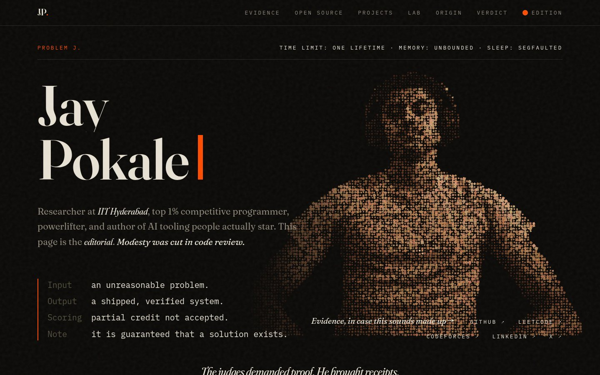
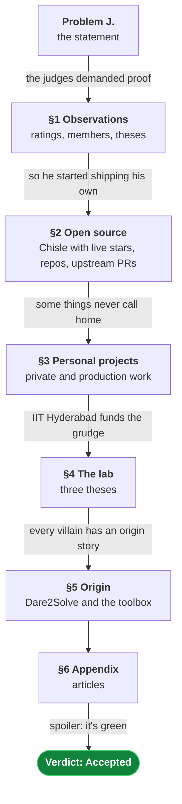
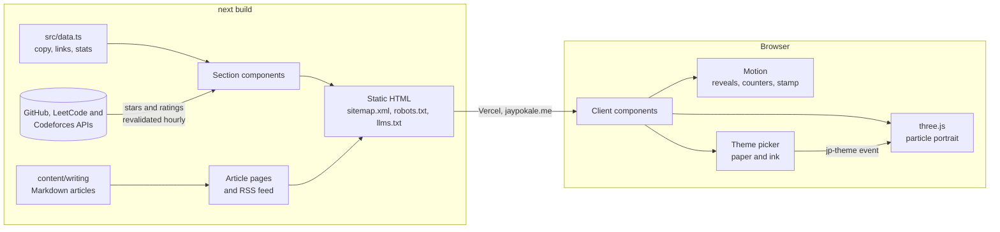

<div align="center">

# Jay Pokale — Problem J.

**The portfolio of Jay Pokale, written as a competitive-programming problem and its editorial.**

[](https://jaypokale.me)
[](https://github.com/JayPokale/modern-portfolio/actions/workflows/ci.yml)


<a href="https://jaypokale.me"></a>

</div>

## The concept

A competitive-programming problem comes with a statement, a few observations and an
editorial that walks to the solution. This site borrows that structure: the hero is the
problem statement, the stats are the observations, the work is the solution in parts, and
the footer is the judge's verdict. Every entry pairs a plain fact with a punchline, and the
punchline is set louder.



## How it works

The page is prerendered to static HTML at build time. Only the interactive pieces hydrate
in the browser.



## Features

- **Static and fast.** Every page is prerendered. Chisle's star count and the LeetCode and
  Codeforces ratings are fetched at build time and refreshed hourly (ISR), falling back to the
  last known values if an API is down. Fonts are self-hosted.
- **Search- and LLM-friendly.** A JSON-LD `ProfilePage` graph (the person, their awards,
  affiliation and every profile), per-page canonical URLs, Open Graph cards with a preview
  image, `sitemap.xml`, `robots.txt` and an [`llms.txt`](public/llms.txt) summary.
- **Writing.** Markdown articles with `BlogPosting` structured data, an RSS feed and
  git-ignored drafts; see [Writing](#writing).
- **Particle portrait.** `Jay.png` is sampled into roughly 12,000 squares drawn by a custom
  shader; the cursor scatters them, and a grayscale source is tinted automatically.
- **Themes.** Dark or light "paper" with any accent "ink" — six presets or a colour picker.
  The choice persists in `localStorage` and is applied before first paint, so nothing flashes.
- **Responsive and calm.** Works down to 320px wide; the film grain and the portrait hold
  still under `prefers-reduced-motion`.
- **No trackers, no cookies, no contact form.** Email works. The form never did.

## Tech stack

| Layer | Choice |
| --- | --- |
| Framework | [Next.js 16](https://nextjs.org) (App Router, static prerendering), React 19 |
| Language | TypeScript, strict mode |
| Styling | Tailwind CSS 4 on CSS design tokens |
| Animation | [Motion](https://motion.dev) |
| Graphics | [three.js](https://threejs.org) with custom GLSL shaders |
| Hosting | Vercel |
| CI | GitHub Actions — type-check and build on every push and pull request |

## Project structure

```text
content/
├── writing/                published articles (Markdown)
└── drafts/                 unpublished articles, git-ignored
src/
├── app/
│   ├── layout.tsx          shared metadata, fonts, theme bootstrap
│   ├── page.tsx            homepage: section order, profile JSON-LD
│   ├── writing/            article index, article pages, rss.xml
│   ├── globals.css         design tokens, type styles, grain overlay
│   ├── robots.ts
│   └── sitemap.ts
├── components/             one file per section, plus shared pieces
│   ├── Problem.tsx         hero: statement, profile links, portrait
│   ├── ParticlePortrait.tsx
│   ├── OpenSource.tsx      fetches Chisle's live star count
│   └── …
├── lib/                    live stats, structured data, the article loader
└── data.ts                 every word of copy, every link and stat
public/                     portrait, favicons, llms.txt
```

## Getting started

Requires Node.js 20 or newer; [`.nvmrc`](.nvmrc) pins the version CI uses.

```sh
npm ci
npm run dev          # http://localhost:3000
```

| Script | What it does |
| --- | --- |
| `npm run dev` | Development server with hot reload |
| `npm run build` | Type-checks and builds the production site |
| `npm start` | Serves the production build |
| `npm run typecheck` | Generates Next's route types, then runs `tsc` |

## Editing content

All copy lives in [`src/data.ts`](src/data.ts); components only decide layout. Entries pair a
`fact`, set small, with a `quip`, set loudest. To add a project, append it to `projects`; to
add an open-source repo, append it to `ownRepos` or `upstream`.

## Writing

Articles are Markdown files with front matter:

```md
---
title: "The title, as it should appear in search results"
description: "One or two sentences for the snippet and link previews."
date: 2026-09-27
---
```

Drafts go in `content/drafts/`: git-ignored, visible only under `npm run dev`. Moving a file
to `content/writing/` publishes it at `/writing/<file-name>` with its own canonical URL,
`BlogPosting` structured data, a sitemap entry and an RSS item, and adds the "Writing" link
and homepage appendix. To syndicate to dev.to or Hashnode, import
[`/writing/rss.xml`](https://jaypokale.me/writing/rss.xml) there with the canonical URL
pointing back here.

## Deployment

Every push to `main` deploys to Vercel. The site is served at
[jaypokale.me](https://jaypokale.me); `jaypokale.vercel.app` redirects there.

## License

© Jay Pokale. All rights reserved.
