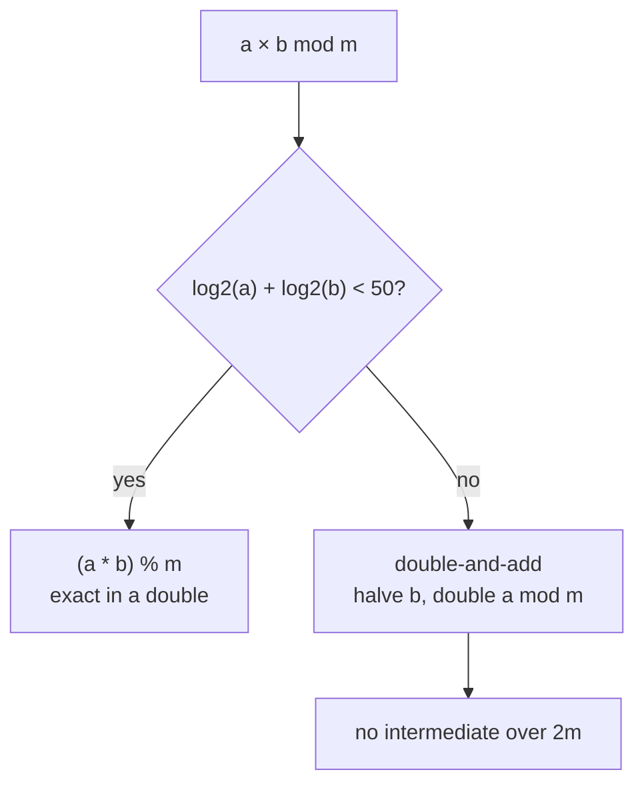

Competitive programming in JavaScript is a decision most people make once. I made it 1,142
times: that's how many of my LeetCode solves are in JavaScript, on the way to a Guardian
badge and the top 1% of contest ratings. C++ got 458. My rating stands by the choice. My
sanity filed an appeal.

Speed is rarely the problem on LeetCode. The standard library is. C++ contestants start with
`priority_queue`, `multiset`, `lower_bound` and 64-bit integers; JavaScript starts with
`Array.prototype.sort` and a shrug. So I wrote
[the missing pieces](https://github.com/JayPokale/competitive). Here's what they are, why
each one exists, and the bug I shipped along the way.

## 1. The priority queue that isn't there

Dijkstra, k-way merges, "the k largest", scheduling: a good share of medium-to-hard
problems want a heap, and JavaScript has none. LeetCode quietly ships a priority-queue package for
JavaScript; most other judges don't, and contest day is a bad time to find out which kind
you're on.

So: a binary heap over a plain array, with a comparator, so the same class is a min-heap, a
max-heap or a heap of `[distance, node]` pairs.

```js
heapifyUp() {
  var currentIndex = this.heap.length - 1;

  while (currentIndex > 0) {
    var parentIndex = (currentIndex - 1) >> 1;
    if (
      this.comparator(this.heap[currentIndex], this.heap[parentIndex]) < 0
    ) {
      this.swap(currentIndex, parentIndex);
      currentIndex = parentIndex;
    } else {
      break;
    }
  }
}
```

It also has `pushPop`, which puts the new value at the root and sifts down once, where a
push followed by a pop would sift twice. When a problem keeps only the k best candidates,
that's half the work per element.

## 2. The 53-bit trap

"Print the answer modulo 10⁹ + 7." In C++ you multiply two residues in a 64-bit integer and
move on. In JavaScript every number is a double, exact only up to 2⁵³, about 9 × 10¹⁵. Two
residues below 10⁹ + 7 multiply to about 10¹⁸. The answer isn't wrong by a lot. It's wrong
by enough.

My own library documents this the hard way. `powMod` has two versions in the same file. The
first uses plain numbers and squares an intermediate result, which silently loses precision
once the modulus passes about 9.5 × 10⁷, so it's wrong for the most common modulus in
competitive programming. The second, right underneath it, uses `BigInt` and is correct.
Both are declared with `var`, so the second one wins. I'd love to call that foresight.

`BigInt` is correct but slow in hot loops, so the `Modulo` class takes a third route: it
multiplies directly when the product provably fits, and otherwise falls back to
double-and-add, which never holds a number larger than twice the modulus.



```js
if (Math.log2(a) + Math.log2(b) < 50) return (a * b) % this.modulo;

var result = 0;
while (b) {
  while (b % 2 === 0) {
    a = (a * 2) % this.modulo;
    b /= 2;
  }

  if (b % 2 !== 0) {
    result = (result + a) % this.modulo;
    b--;
  }
}
```

Division comes from Euler's theorem: `getInverse(a)` raises `a` to φ(m) − 1, with φ computed
once and cached.

## 3. The multiset, and the ordered set I don't have

C++'s `multiset` does two jobs: it counts duplicates and it keeps them in order. My
`Multiset` does the first, a `Map` from value to count with `add`, `delete`, `get` and
`has`. It handles the second by not pretending: there's no `lower_bound` on a hash map.

For the ordering half, the library leans on structures JavaScript runs well: `bisect` and
`bisectLeft` over sorted arrays, segment trees for range minimum and maximum, and a Fenwick
tree for prefix sums. The Fenwick tree keeps its values in an `Int32Array`, since typed
arrays are the closest thing JavaScript has to a C array, which is also why
[typed-numarray](https://www.npmjs.com/package/typed-numarray) exists.

## 4. Reading input without losing to it

On judges that feed input through stdin, reading it line by line through callbacks is a
reliable way to time out on a correct solution. The template reads everything once, splits
it, and hands out lines:

```js
function readline() {
  return inputString[currentLine++];
}

function main() {
  var t = +readline();
  while (t--) solve();
}
```

## What JavaScript still can't do

It can't give you an ordered set with logarithmic insert, delete and successor, not without
writing a balanced tree or a treap under contest pressure. It can't give you full-speed
64-bit integer arithmetic. And a deep recursive DFS can hit V8's stack limit, so an
iterative version is worth keeping ready.

On Codeforces, where time limits are set with C++ in mind, my submissions are in C++.
LeetCode is where the JavaScript got its 1,142 green checkmarks.

The library covers more than this post: KMP, the Z-function, Manacher's and Rabin–Karp for
strings; Dijkstra and Floyd–Warshall; union-find; tries, including a bit trie with removal;
digit DP and combinatorics. The functions carry JSDoc, so your editor tells you what they
take before the judge tells you what it thinks.

It's all on [GitHub](https://github.com/JayPokale/competitive). Copy what you need. Everyone
climbing behind me deserves a heap.
