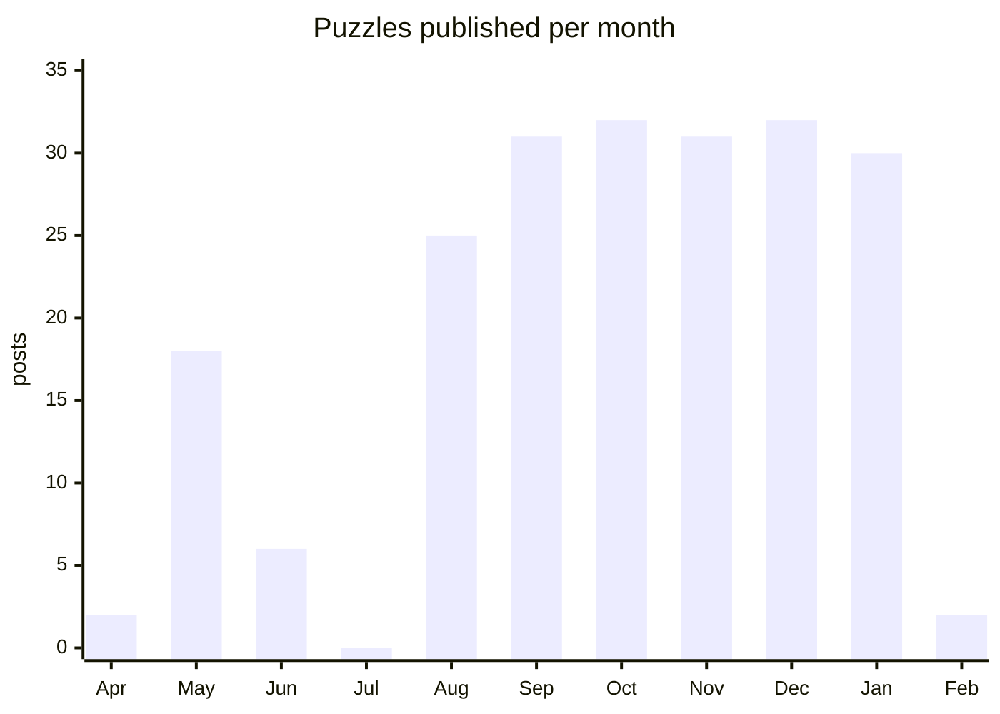

In 2021 I was a mechanical engineering student at GCOEY, the pandemic had moved life
indoors, and I started posting math puzzles online, each with its solution. The plan, as I
wrote on the site's About page back then, was "to provide daily new maths puzzles and their
solutions to create interest about maths in young students."

"Daily" is a big word to put on an About page. So I checked the archive.

## What the archive says

The original blog holds 209 puzzle posts. The first two went up in April 2021; Dare2Solve
officially started in May, which means the puzzles predate the project, the most on-brand
thing about it. Then, from August 2021 through January 2022, the blog published 181 puzzles
in six months:

Thirty-two puzzles in a thirty-one-day month is not "about daily". It's more than daily,
twice. July has a zero in it, and I'm choosing to believe July was a well-earned break.

The puzzles were the kind that look innocent in a thumbnail: a semicircle inside a
rectangle and the two areas its diagonal cuts off, the fraction of a square that's shaded
blue, an infinite series with a finite answer, and *xy + yx = a, find the
integers x and y*. Each one came with a worked solution, because a puzzle without a
solution is just a way to make a teenager feel bad.

## 20,000 people who were told math is scary

The community around it grew past 20,000 people. None of them were paid, plenty of them,
I'd bet, had been told at some point that math wasn't for them, and they showed up anyway
for a square with some of it shaded blue. That's still the best evidence I have that difficulty is
mostly a rumor.

## A website that came full circle

The site has moved more often than the puzzles did:

Blogger, then WordPress, then a Next.js site on Vercel pulling its content over GraphQL,
and today it's back on Blogger at its own subdomain. The loop closed on the platform that was already hosting all 209 posts, which is
either poetic or the sunk-cost fallacy. I've decided it's poetic.

## What it taught me

Writing a solution for a stranger is different from finding one. You have to know which
step they'll trip on, and explain that step before they reach it. I wrote 209 of those,
and every "editorial" on this site, including the one the whole site is framed as, owes
something to that habit.

The mechanical engineering student eventually became a top 1% competitive programmer and a
researcher at IIT Hyderabad. The math page didn't plan that. It just kept showing up every
day, and so did I.

The puzzles are still up at [dare2solve.jaypokale.me](https://dare2solve.jaypokale.me).
Pick one. The solution is right there, but try first.
