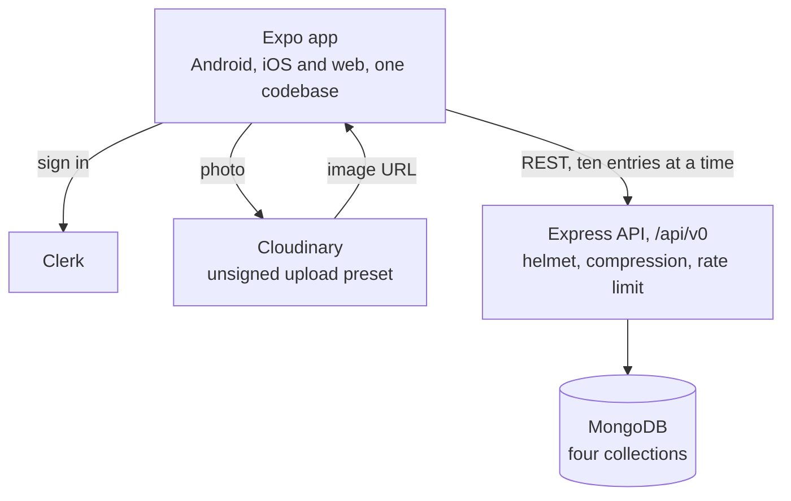
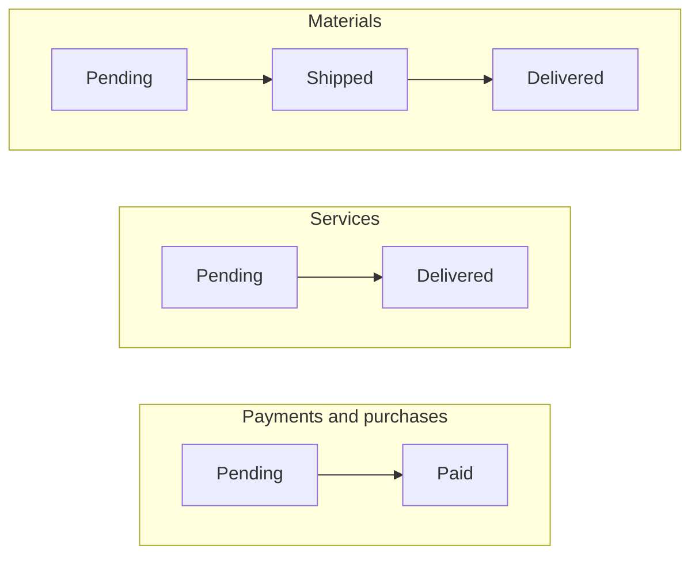

The ask was one app for four kinds of office records (materials going out, service jobs,
purchases and payments) on Android, iOS and the web. The budget was one developer. The
developer was me, so the budget was also my evenings.

The trick to four platforms with one developer is not writing four apps. This is one
[Expo](https://expo.dev) codebase: Expo Router for navigation, React Native for Android and
iOS, and `react-native-web` with a static export for the browser. The backend is a small
Express API over MongoDB. Here's how the pieces meet.



## Four ledgers, one spine

Each ledger is a tab (Materials, Payments, Purchases, Services) and a Mongoose model. They
share a spine: who created the entry, a date, the customer and company, free-text details,
a status and an optional photo. Then each adds what only it needs: a challan number and
dispatch details for materials, a bill number and the amount still owed for payments, the
material used and its cost for purchases, the fault for a service job.

The statuses are where the office actually lives:



Every list colours its entries by status, so "what's still pending" is a glance rather than
a query.

## The API is five routes, four times

Each ledger gets the same five REST routes (create, list, read, update, delete) mounted
under `/api/v0`. In front of them sit the boring things that matter: `helmet` for headers,
`compression`, request logging, and a rate limit of 100 requests per IP every 15 minutes,
because an office app does not need to survive a DDoS, but it shouldn't make one easy.

Listing uses the cheapest pagination trick I know. Ask for one more row than you'll show:

```js
const materialEntries = await MaterialEntry.find(query)
  .sort({ createdAt: "desc" })
  .skip(skip)
  .limit(11);

const hasMoreEntries = materialEntries.length === 11;

res.status(200).json({
  entries: materialEntries.slice(0, 10),
  hasMoreEntries,
});
```

If the eleventh row exists, there's another page. No count query, no second round trip,
and the app keeps loading while `hasMoreEntries` stays true.

## Photos never touch the API

Entries can carry a photo, and photos are megabytes. The app uploads them straight from the phone to Cloudinary with an unsigned upload preset and stores
only the returned URL on the entry. The Express server never sees an image, which is the
cheapest way to keep a small server small.

## What I'd change today

With two more years behind me, here's what I'd change:

- **Four near-identical controllers** would be one generic CRUD factory taking a model.
  Four copies of the same code are four places to fix the same bug.
- **Offset pagination** (`skip`) gets slower as a collection grows, because the database
  still walks every skipped row. Paging by `createdAt` from the last entry seen would stay
  constant.
- **Validation lives in Mongoose.** Fine for a first version; a schema shared between the
  app and the API would catch bad input before it travels.

One developer, four platforms. The mercy was optional.

The code is on [GitHub](https://github.com/JayPokale/Office-management).
