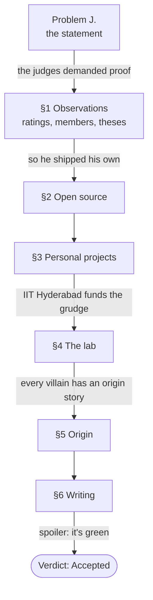
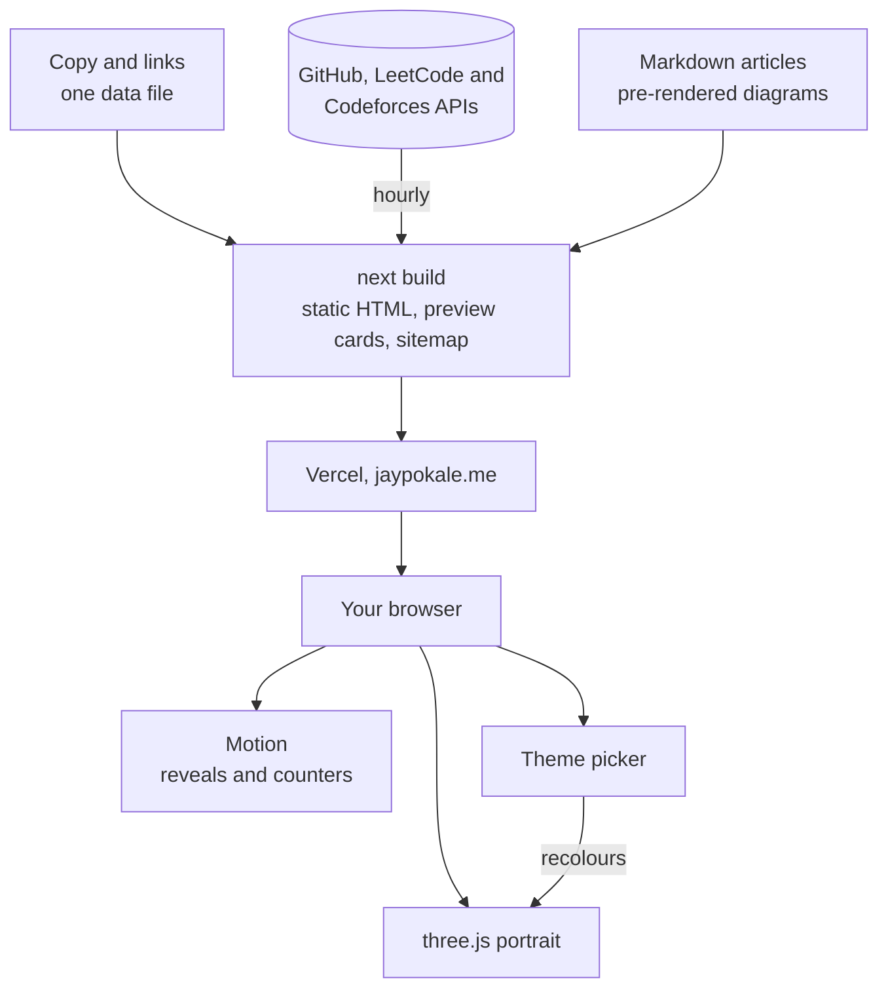

Every competitive-programming problem has the same shape: a statement, a few observations,
an editorial that walks you to the solution, and a judge who says *Accepted* or doesn't.
After more than 1,600 of them, it's the shape I think in. So my portfolio is one.

The hero is the problem statement, complete with the header every judge prints: *time
limit: one lifetime · memory: unbounded · sleep: segfaulted*. Below it, Input is "an
unreasonable problem", Output is "a shipped, verified system", and the Note is the line
every problem setter uses to calm you down: *it is guaranteed that a solution exists.*



## Facts quiet, jokes loud

Most entries on the page are two lines: a fact in small monospace, and a punchline in italic
at full brightness. The typography makes the priority obvious. If you only read the loud
lines, you get the jokes; if you read the quiet ones, you get the résumé. Most people read
both, which is the point.

## A portrait in 12,000 pieces

The hero portrait is a photo sampled into roughly 12,000 squares, each drawn by a small
WebGL shader with three.js. They breathe a little at rest. Bring the cursor close and they
scatter, pushed outward with a sideways swirl so the effect looks like a disturbance rather
than an explosion:

```glsl
// cursor scatter — radial push plus a tangential swirl
vec2 d = pos.xy - uMouse;
float dist = length(d);
float force = smoothstep(uRadius, 0.0, dist) * uHover * uMotion;
vec2 dir = normalize(d + 0.0001);
vec2 tangent = vec2(-dir.y, dir.x);
pos.xy += dir * force * uRadius * 0.5;
pos.xy += tangent * force * uRadius * 0.35 * (aRand.x - 0.5) * 2.0;
```

`uMotion` is zero when your system asks for reduced motion, so the same shader also knows
how to hold still. If the source photo is grayscale, the code tints it along a warm ramp,
umber shadows to cream highlights, so the portrait always matches the page. Pick a new
accent colour in the theme menu and the disturbed squares flash that colour instead.

## Numbers that update themselves

Stats on a portfolio go stale the day you write them. These don't: Chisle's GitHub stars,
my LeetCode peak and percentile, and my Codeforces rating are fetched when the site builds
and refreshed hourly, each with a last-known fallback so a slow API never breaks a deploy.



Everything is prerendered to static HTML; only the portrait, the animations and the theme
picker run in your browser.

## Two bugs hiding in plain sight

**The black band.** The page has a film-grain overlay: a noise texture twice the size of
the screen, jumping around in steps to look like film. It overhangs the screen by half a
screen on every side, so no jump may move it more than a quarter of its own size, or an edge
of the screen runs out of grain. One keyframe moved it 35%. For about 0.6 seconds in
every eight, the top fifth of the screen went flat and dark. I measured it, capped every
step at 15%, and the band was gone.

**The zeros.** The stat counters count up when you scroll to them, which means they started
at zero. In the HTML. So anything that read the page without running JavaScript (link
unfurlers, some crawlers) saw a top 1% competitive programmer with a rating of 0. They now
ship the real number and only reset to zero in the browser, right before they count up.

## Being findable

A portfolio nobody finds is a diary. The page describes itself to search engines as a
profile of one person, with the awards, the university and every profile I own linked in
structured data. Articles get their own preview cards, generated at build time from the
title. There's a sitemap that covers the sister sites, an `llms.txt` for language models,
and new pages get announced to Bing through IndexNow.

The diagrams in this article are part of that too. They're Mermaid, rendered to SVG ahead
of time and themed with placeholder colours that turn into the site's own CSS variables, so
they switch with light and dark mode and load without a line of JavaScript.

## Verdict

The code is on [GitHub](https://github.com/JayPokale/modern-portfolio), with the same
diagrams in its README. The judge's verdict is at the bottom of
[the page](https://jaypokale.me). Spoiler: it's green.
