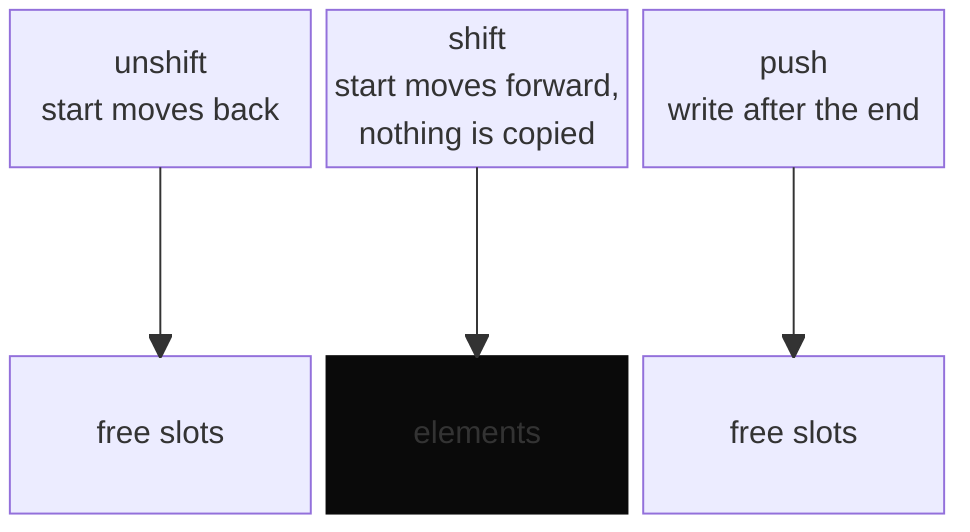
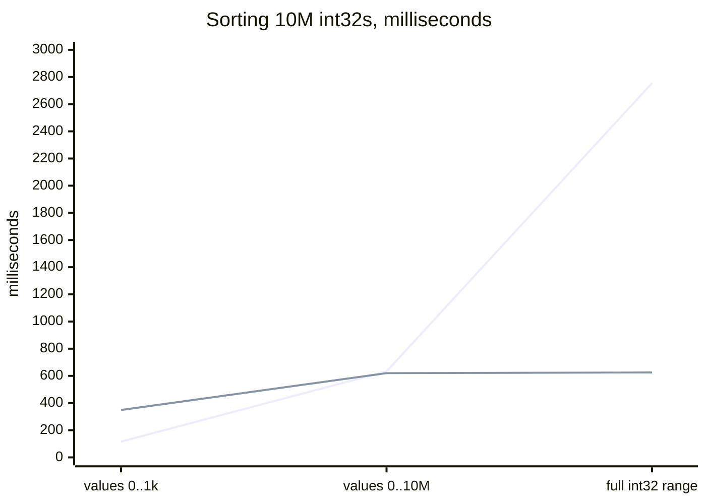

Typed arrays are the fastest numbers JavaScript has: one type, contiguous memory, no
surprises. They also can't grow. The moment you need a `push`, you're back to a normal
array, which can hold anything and has to be ready for anything.

[typed-numarray](https://www.npmjs.com/package/typed-numarray) is my attempt at both: a typed
array you can push, pop, shift and unshift, with the usual array methods on top. Ten numeric
types, from `int8` up to 64-bit `BigInt`, one call:

```js
import NumArray from "typed-numarray";

const scores = NumArray("int32", 10);
scores.push(42);
scores.unshift(7);
scores.shift(); // 7, in constant time
```

I published it in 2023. Three years later I re-read the code and re-ran the benchmarks, so
this is the version with receipts.

## A buffer with room at both ends

Every NumArray is an `ArrayBuffer`, a typed view over it, and two numbers: where the
elements start, and how much capacity there is. Appending past the end doubles the
capacity. Inserting at the front when there's no room grows the buffer by a quarter and
puts all of that headroom *in front*, so a run of `unshift` calls doesn't move every element
each time.



`shift` never copies anything: it moves the start index. That's the whole trick, and it is
the part that pays for itself most.

## Sorting integers by counting them

For integer arrays, `sort()` with no comparator looks at the value range first. If
counting beats comparing, it counts:

```js
var range = maxElement - minElement + 1;

if (this.length + range > this.length * Math.log2(this.length)) {
  return arr.sort((a, b) => a - b);
}
```

Past that check it tallies every value into a frequency array (a `Uint8Array`,
`Uint16Array` or `Uint32Array`, whichever is just big enough to count the array's length)
and writes the values back in order. Linear time, as long as the values are bounded.

## What I measured

Node 26, median of three runs, 10 million random `int32` values for the sorts and 100,000
operations for the deques:

| task | typed-numarray | Array + comparator | Int32Array#sort() |
|---|--:|--:|--:|
| sort, values 0–1,000 | 116 ms | 1,939 ms | 349 ms |
| sort, values 0–10M | 633 ms | 2,777 ms | 620 ms |
| sort, full int32 range | 2,755 ms | 3,264 ms | 625 ms |
| 100k × shift | 2 ms | 569 ms | — |
| 100k × unshift | 3 ms | 576 ms | — |



*Orange: typed-numarray. Grey: a plain `Int32Array#sort()`.*

The README promises "over 5x" on sorting. Against a normal array it's 17× on bounded
values, 4.4× on the 0–10M spread and 1.2× on the full range, so "5x" was an average of good
days. Against a plain `Int32Array`, which V8 sorts natively when you pass no comparator,
the story has three acts:

- **It wins** on bounded values: counting a thousand distinct values beats any comparison
  sort, native or not, by 3×.
- **It ties** on the 0–10M spread. Counting still runs (twenty million steps against a
  quarter-billion comparisons on paper), but walking a 40 MB tally table costs about what
  the native sort does.
- **It loses** on the full 32-bit range, 4.4× slower than native. There the range is too
  wide to count, and the fallback calls `sort((a, b) => a - b)`: a JavaScript comparator on
  a typed array, which throws away the native numeric sort. The fix is one line: call
  `sort()` with no comparator, since typed arrays already sort numerically.

The deque numbers are the real story. A normal array's `shift` can move every remaining
element; this one moves an index.

## The benchmark that worked by accident

Every performance script in the repo creates its array like this:

```js
var int32 = NumArray(int32, n);
```

No quotes. `int32` isn't a string there; it's the variable being declared on that very
line, which `var` hoisting has already created as `undefined`. Passing `undefined` triggers
the default parameter, which happens to be `"int32"`. So the benchmarks ran the right type
for three years, entirely on vibes. The numbers above come from a fixed script.

## When to use it

Reach for it when you need a numeric buffer that grows, especially one you consume from the
front: a queue of events, a sliding window, BFS over millions of nodes. Skip it when you
have a fixed-size array and just want it sorted: `new Int32Array(data).sort()` is already
as fast as it gets, and on full-range values it currently beats mine.
I'd rather you know that from me.

```bash
npm install typed-numarray
```

The source is on [GitHub](https://github.com/JayPokale/typed-numarray). It's also why my
competitive-programming library stores its Fenwick tree in an `Int32Array`: once you've
seen what typed memory does to a hot loop, it's hard to go back.
